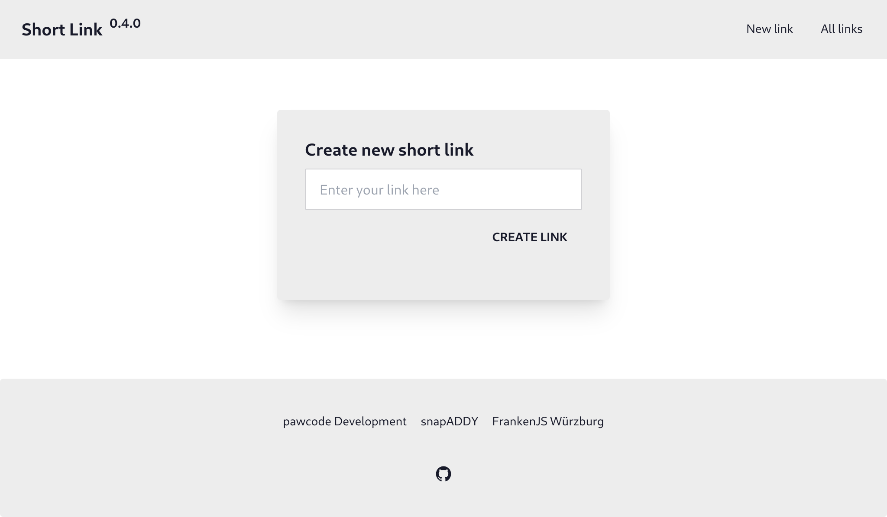

# Short Link

This is a small demo project for showcasing the power of HTMX together with Bun.
It was originally created for a talk of mine at [FrankenJS Würzburg](https://www.meetup.com/de-DE/front-end-wuerzburg/) as an introduction to HTMX.
To learn more about this project, you can read the [blog post](https://blog.pawcode.de/posts/introduction-to-htmx) I wrote about it after the talk.

## What is short link?



It is just a basic link shortener, with the ability to:

- Create new short links
- Use these short links to redirect to the original page
- List all generated links and their usage
- Delete old links

_Please **do not** use this application in production as it has no security features built in and everyone can see and delete your links._

## How to start the application

To run the application you first need to have [Bun](https://bun.sh/) installed. If not, you can do it by running:

```bash
curl -fsSL https://bun.sh/install | bash
```

After you installed bun (and reloaded your .bashrc if necessary), you need to install the project and its dependencies by running:

```bash
# Download project files
git clone git@github.com:pawcoding/short-link.git
cd short-link

# Install dependencies
bun install
```

To then run the application, just type:

```bash
# Start the application
bun run start

# Or for automatic restarting
bun run dev
```
